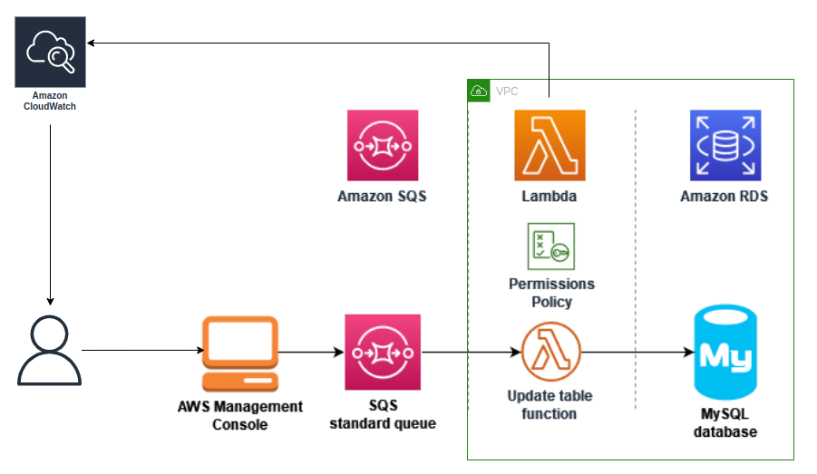
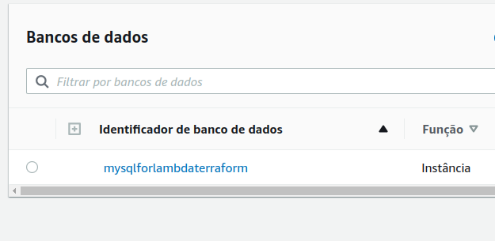
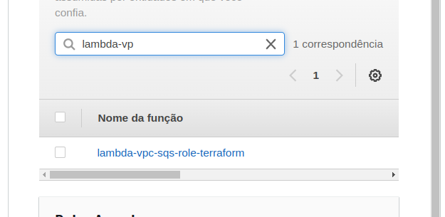
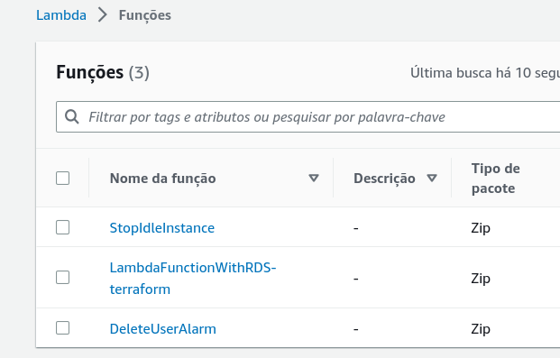
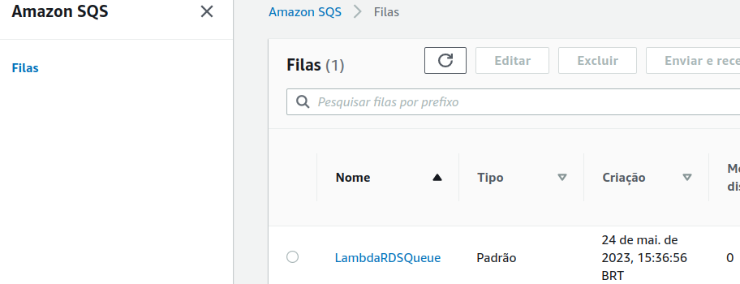
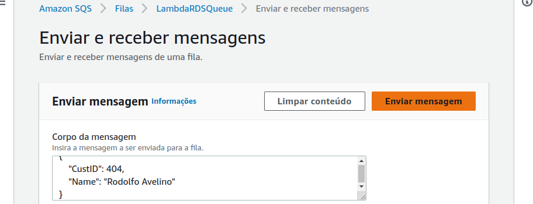
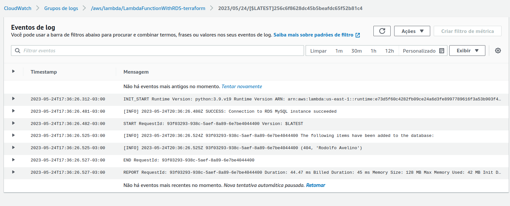

# **Roteiro: configuração de uma função do Lambda para acessar o Amazon RDS em uma Amazon VPC**

- **Aluno:** Lorran Caetano Machado Lopes
- **Curso:** Engenharia da Computação
- **Semestre:** 6
- **Contato:** lorrancml@al.insper.edu.br
- **Ano:** 2023

## Pré-requisitos

Para seguir esse tutorial é necessário:

- **Ubuntu > 20.0 ou WSL2**
- **Conta da AWS:**  uma conta com permissões de administrador.
- **Terraform** 

!!! info 
    Você pode se cadastrar em uma conta da AWS aqui:
    
    - http://portal.aws.amazon.com/billing/signup

    Caso não tenha o Terraform instalado em sua máquina, você pode obtê-lo aqui:
    
    - https://developer.hashicorp.com/terraform/downloads

## Motivação

Ao concluir esse roteiro, teremos provisionado uma arquitetura que contem uma função Lambda que grava dados em um banco de dados do Amazon RDS, por meio da leitura de dados de uma fila do Amazon SQS sempre que uma mensagem é adicionada. 
Ao usar o Lambda para acessar seu banco de dados, você pode ler e gravar dados em resposta a eventos. Sua função e instância de banco de dados também se escalam automaticamente para atender a períodos de alta demanda.


----------------------------------------------


## AWS

A Amazon Web Services (AWS) é a plataforma de nuvem mais adotada e mais abrangente do mundo, oferecendo mais de 200 serviços completos de datacenters em todo o mundo. Milhões de clientes, incluindo as startups que crescem mais rápido, as maiores empresas e os maiores órgãos governamentais, estão usando a AWS para reduzir custos, ganhar agilidade e inovar mais rapidamente.

Para conseguir interagir com os serviços e funções que a AWS provém, por meio de IaC (Infrastructure as Code), é necessário obter [chaves de acesso](https://docs.aws.amazon.com/IAM/latest/UserGuide/id_credentials_access-keys.html), que permitam o gerenciamento e provisionamento dos recursos que desejamos alocar na nuvem.

Guarde a chave de acesso para criar variáveis de ambiente antes de iniciar o Terraform, na fase final do roteiro.


## RDS

O Amazon RDS (Relational Database Service) é um serviço de banco de dados gerenciado da AWS que permite criar e gerenciar bancos de dados relacionais, como MySQL, PostgreSQL, Oracle, SQL Server, entre outros.
O RDS gerencia tarefas como provisionamento de hardware, instalação de software, backup e recuperação, bem como monitoramento e dimensionamento automático.


## Funções AWS Lambda

O AWS Lambda é um serviço de computação sem servidor e orientado a eventos que permite executar código para praticamente qualquer tipo de aplicação ou serviço de backend sem provisionar ou gerenciar servidores. É possível acionar o Lambda a partir de mais de 200 serviços da AWS e aplicações de software como serviço (SaaS).
Nesse roteiro, você irá usar o Lambda para abrir uma conexão com uma instância de banco de dados do Amazon RDS e para realizar operações de criação e leitura em um banco de dados do Amazon RDS.

## AWS SQS

O Amazon Simple Queue Service (AWS SQS) é um serviço de mensagens gerenciadas pela Amazon Web Services (AWS) que permite que diferentes componentes de um sistema se comuniquem entre si de forma assíncrona. Ele funciona como uma fila virtual, onde as mensagens são armazenadas até que sejam processadas pelos consumidores. O SQS garante a entrega das mensagens, mesmo em situações de alta demanda ou falhas temporárias, tornando-o uma solução escalável e confiável para sistemas distribuídos.

## Amazon CloudWatch

O Amazon CloudWatch é um serviço de monitoramento e observabilidade oferecido pela Amazon Web Services (AWS). Ele permite que você colete, monitore e analise métricas, logs e eventos gerados pelos recursos e aplicativos em execução na AWS. O CloudWatch oferece uma visão abrangente do desempenho e saúde dos seus sistemas, permitindo que você identifique problemas, tome decisões baseadas em dados e tome ações corretivas.


## Iniciando nossa infraestrutura

Crie uma pasta para organizar nossos arquivos chamada **terraform**:

```
mkdir terraform 
cd terraform
```

Crie também um arquivo **main.tf**. Nele, criaremos todos os nossos [recursos](https://developer.hashicorp.com/terraform/language/resources).

```
touch main.tf
```

Primeiramente, iremos criar uma instância de banco de dados do Amazon RDS. Para tanto, podemos inserir o trecho abaxaixo no nosso **main.tf**:

``` tf title="main.tf"
# Cria uma instância de banco de dados do Amazon RDS
resource "aws_db_instance" "example" {
  engine                = "mysql"
  identifier            = "mysqlforlambdaterraform"
  allocated_storage     = 5
  max_allocated_storage = 100
  instance_class        = "db.t2.micro"
  publicly_accessible   = false

  db_name             = "ExampleDB"
  username            = "admin"
  password            = "senhaDoBancoDeDados"
  skip_final_snapshot = true

  vpc_security_group_ids = [aws_default_security_group.default.id]
}
```

:warning: Você pode alterar o **db_name**, **username** e **password** pelos valores que você deseja para o seu banco de dados. :warning:

Agora, antes de criar sua função do Lambda, você deve criar um perfil de execução para dar à sua função as permissões necessárias. Para este roteiro, o Lambda precisa de permissão para gerenciar a conexão de rede com a Amazon VPC contendo sua instância de banco de dados, para pesquisar mensagens de uma fila do Amazon SQS e para criar grupos de logs, fluxos de logs e enviar eventos de logs. 

Faremos isso pelo IAM. Vamos adicionar a criação no **main.tf**.

``` tf title="main.tf" hl_lines="8 9 10 11 12 13 14 15 16 17 18 19 20 21 22 23 24 25 26 27 28 29 30 31 32 33 34 35 36 37 38 39 40 41 42 43 44 45 46 47 48 49 50 51 52 53 54 55 56 57 58 59 60 61 62 63 64 65 66 67 68"

# Cria uma instância de banco de dados do Amazon RDS
resource "aws_db_instance" "example" {
  #################
  # Código omitido
  ################
}

# Cria um perfil de execução de função
resource "aws_iam_role" "role" {
  name = "lambda-vpc-sqs-role-terraform"
  assume_role_policy = jsonencode({
    Version = "2012-10-17"
    Statement = [{
      Action = "sts:AssumeRole"
      Effect = "Allow"
      Principal = {
        Service = "lambda.amazonaws.com"
      }
    }]
  })
}

# Cria uma policy 
resource "aws_iam_policy" "policy" {
  name = "necessary-policy"
  policy = jsonencode({
    "Version" : "2012-10-17",
    "Statement" : [
      {
        "Sid" : "VisualEditor0",
        "Effect" : "Allow",
        "Action" : [
          "ec2:CreateNetworkInterface",
          "ec2:DescribeNetworkInterfaces",
          "ec2:DeleteNetworkInterface"
        ],
        "Resource" : "*"
      },
      {
        "Effect" : "Allow",
        "Action" : [
          "sqs:ReceiveMessage",
          "sqs:DeleteMessage",
          "sqs:GetQueueAttributes",
          "sqs:SendMessage",
          "sqs:GetQueueUrl"
        ],
        "Resource" : "*"
      },
      {
        "Effect" : "Allow",
        "Action" : [
          "logs:CreateLogGroup",
          "logs:CreateLogStream",
          "logs:PutLogEvents"
        ],
        "Resource" : "arn:aws:logs:*:*:*"
      }
    ]
  })
}


#associamos a policy à função IAM
resource "aws_iam_role_policy_attachment" "example" {
  policy_arn = aws_iam_policy.policy.arn
  role       = aws_iam_role.role.name
}


```

Vamos agora criar o pacote de implantação do Lambda.

Primeiramente, vamos criar uma pasta que servirá para a instalação da biblioca que usaremos no código Python e o arquivo em si, que serão compactados posteriormente.

Rode o comando abaixo no terminal para criar a pasta com o nome **source_lambda**:

```
mkdir source_lambda 
```
Agora, vamos instalar a biblioteca na pasta criada:

```
pip install --target source_lambda pymysql
```

Feito isso, vamos criar o nosso código para a função Lambda.

O exemplo de código Python a seguir usa o pacote [PyMySQL](https://pymysql.readthedocs.io/en/latest/) para abrir uma conexão com seu banco de dados. Na primeira vez que você invoca sua função, ela também cria uma nova tabela chamada Customer. A tabela usa o seguinte esquema, em que CustID é a chave primária:

```python
Customer(CustID, Name)
```

A função também usa a PyMySQL para adicionar registros a essa tabela. A função adiciona registros usando os IDs de clientes e nomes especificados nas mensagens que você adicionará à sua fila do Amazon SQS.

Observe que o código cria a conexão com seu banco de dados fora da função do manipulador. A criação da conexão no código de inicialização permite que a conexão seja reutilizada por invocações subsequentes de sua função e melhora o desempenho. 

Adicione o novo trecho abaixo no seu **main.tf**:
``` tf title="main.tf" hl_lines="28 29 30 31 32 33 34 35 36 37 38 39 40 41 42 43 44 45 46 47 48 49 50 51 52 53 54 55 56 57 58 59 60 61 62 63 64 65 66 67 68 69 70 71 72 73 74 75 76 77 78 79 80 81 82"
# Cria uma instância de banco de dados do Amazon RDS
resource "aws_db_instance" "example" {
  #################
  # Código omitido
  ################
}

# Cria um perfil de execução de função
resource "aws_iam_role" "role" {
  #################
  # Código omitido
  ################
}

# Cria uma policy 
resource "aws_iam_policy" "policy" {
  #################
  # Código omitido
  ################
}

#associamos a policy à função IAM
resource "aws_iam_role_policy_attachment" "example" {
  #################
  # Código omitido
  ################
}

resource "local_file" "python_script" {
  filename = "./source_lambda/lambda_function.py"
  content  = <<-EOF
import sys
import logging
import pymysql
import json

# rds settings
rds_host  = "${aws_db_instance.example.endpoint}"[:-5]
user_name = "admin"
password  = "senhaDoBancoDeDados"
db_name   = "ExampleDB"

logger = logging.getLogger()
logger.setLevel(logging.INFO)

# create the database connection outside of the handler to allow connections to be
# re-used by subsequent function invocations.
try:
    conn = pymysql.connect(host=rds_host, user=user_name, passwd=password, db=db_name, connect_timeout=5)
except pymysql.MySQLError as e:
    logger.error("ERROR: Unexpected error: Could not connect to MySQL instance.")
    logger.error(e)
    sys.exit()

logger.info("SUCCESS: Connection to RDS MySQL instance succeeded")

def lambda_handler(event, context):
    """
    This function creates a new RDS database table and writes records to it
    """
    message = event['Records'][0]['body']
    data = json.loads(message)
    CustID = data['CustID']
    Name = data['Name']

    item_count = 0
    sql_string = f"insert into Customer (CustID, Name) values({CustID}, '{Name}')"

    with conn.cursor() as cur:
        cur.execute("create table if not exists Customer ( CustID  int NOT NULL, Name varchar(255) NOT NULL, PRIMARY KEY (CustID))")
        cur.execute(sql_string)
        conn.commit()
        cur.execute("select * from Customer")
        logger.info("The following items have been added to the database:")
        for row in cur:
            item_count += 1
            logger.info(row)
    conn.commit()

    return "Added %d items to RDS MySQL table" %(item_count)
EOF
}

```

!!! info 
    Repare que o "rds_host" é explicitamente dependente do resource que cria o banco de dados. 
    Além disso, o slicing no final é feito pois a propriedade .endpoint retorna a porta ":3306", que a biblioteca pymsql já usa por padrão. 

!!! warning
    Use os valores de **db_name**, **username** e **password** pelos que você usou na criação do database.
    Em produção, é recomendado não codificar esses dados em função, mas sim usar o [AWS Secrets Manager](https://docs.aws.amazon.com/secretsmanager/latest/userguide/intro.html) para armazenar com segurança as credenciais de acesso ao banco de dados.


Agora, temos tudo para criar o nosso **.zip** para a função Lambda:


``` tf title="main.tf" hl_lines="35 36 37 38 39 40"
# Cria uma instância de banco de dados do Amazon RDS
resource "aws_db_instance" "example" {
  #################
  # Código omitido
  ################
}

# Cria um perfil de execução de função
resource "aws_iam_role" "role" {
  #################
  # Código omitido
  ################
}

# Cria uma policy 
resource "aws_iam_policy" "policy" {
  #################
  # Código omitido
  ################
}

#associamos a policy à função IAM
resource "aws_iam_role_policy_attachment" "example" {
  #################
  # Código omitido
  ################
}

resource "local_file" "python_script" {
  #################
  # Código omitido
  ################
}

data "archive_file" "lambda_archive" {
  depends_on  = [local_file.python_script]
  source_dir  = "./source_lambda"
  output_path = "lambda_function.zip"
  type        = "zip"
}
```
!!! info 
    Repare que o *resource* "lambda_archive" é implicitamente dependente do *resource* que cria o arquivo .py. 

Vamos criar nossa função Lambda. Fazemos isso por meio da inserção do resource abaixo:

``` tf title="main.tf" hl_lines="43 44 45 46 47 48 49 50 51 52 53 54 55 56 57"
# Cria uma instância de banco de dados do Amazon RDS
resource "aws_db_instance" "example" {
  #################
  # Código omitido
  ################
}

# Cria um perfil de execução de função
resource "aws_iam_role" "role" {
  #################
  # Código omitido
  ################
}

# Cria uma policy 
resource "aws_iam_policy" "policy" {
  #################
  # Código omitido
  ################
}

#associamos a policy à função IAM
resource "aws_iam_role_policy_attachment" "example" {
  #################
  # Código omitido
  ################
}

# Cria o arquivo Python
resource "local_file" "python_script" {
  #################
  # Código omitido
  ################
}

# Cria o ZIP para a função Lambda
data "archive_file" "lambda_archive" {
  #################
  # Código omitido
  ################
}

# Cria a função Lambda
resource "aws_lambda_function" "test_lambda" {
  filename      = "lambda_function.zip"
  function_name = "LambdaFunctionWithRDS-terraform"
  role          = aws_iam_role.role.arn
  handler       = "lambda_function.lambda_handler"
  runtime       = "python3.9"

  vpc_config {
    subnet_ids         = aws_default_subnet.default[*].id
    security_group_ids = [aws_default_security_group.default.id]
  }

  depends_on = [ data.archive_file.lambda_archive ]
}
```

!!! info 
    Repare que o *resource* "test_lambda" é explicitamente dependente do resource que cria o arquivo **.zip**. 


Agora iremos configurar a VPC padrão que é usada pelo banco de dados e pelo Lambda.
Também as mesmas sub-redes para ambos.
Além disso, é preciso definir regra de entrada para a porta que o banco de dados usa (:3306) e regra de saída (deixaremos todas).

``` tf title="main.tf" hl_lines="51 52 53 54 55 56 57 58 59 60 61 62 63 64 65 66 67 68 69 70 71 72 73 74 75 76 77"
# Cria uma instância de banco de dados do Amazon RDS
resource "aws_db_instance" "example" {
  #################
  # Código omitido
  ################
}

# Cria um perfil de execução de função
resource "aws_iam_role" "role" {
  #################
  # Código omitido
  ################
}

# Cria uma policy 
resource "aws_iam_policy" "policy" {
  #################
  # Código omitido
  ################
}

#associamos a policy à função IAM
resource "aws_iam_role_policy_attachment" "example" {
  #################
  # Código omitido
  ################
}

# Cria o arquivo Python
resource "local_file" "python_script" {
  #################
  # Código omitido
  ################
}

# Cria o ZIP para a função Lambda
data "archive_file" "lambda_archive" {
  #################
  # Código omitido
  ################
}

# Cria a função Lambda
resource "aws_lambda_function" "test_lambda" {
  #################
  # Código omitido
  ################ conseguimos subir um bucket privado de uso geral, podemos também modificar nossa inf
}


resource "aws_default_subnet" "default" {
  count             = 6
  availability_zone = element(["us-east-1a", "us-east-1b", "us-east-1c", "us-east-1d", "us-east-1e", "us-east-1f"], count.index)

}

resource "aws_default_security_group" "default" {
  vpc_id = aws_default_vpc.default.id

  ingress {
    from_port   = 3306
    to_port     = 3306
    protocol    = "tcp"
    cidr_blocks = ["0.0.0.0/0"]
  }

  egress {
    from_port   = 0
    to_port     = 0
    protocol    = "-1"
    cidr_blocks = ["0.0.0.0/0"]
  }

}

resource "aws_default_vpc" "default" {
}


```

Agora você deve criar a fila do Amazon SQS que usará para invocar sua função do Lambda:

``` tf title="main.tf" hl_lines="66 67 68 69 70 71 72 73 74 75 76 77"
# Cria uma instância de banco de dados do Amazon RDS
resource "aws_db_instance" "example" {
  #################
  # Código omitido
  ################
}

# Cria um perfil de execução de função
resource "aws_iam_role" "role" {
  #################
  # Código omitido
  ################
}

# Cria uma policy 
resource "aws_iam_policy" "policy" {
  #################
  # Código omitido
  ################
}

#associamos a policy à função IAM
resource "aws_iam_role_policy_attachment" "example" {
  #################
  # Código omitido
  ################
}

# Cria o arquivo Python
resource "local_file" "python_script" {
  #################
  # Código omitido
  ################
}

# Cria o ZIP para a função Lambda
data "archive_file" "lambda_archive" {
  #################
  # Código omitido
  ################
}

# Cria a função Lambda
resource "aws_lambda_function" "test_lambda" {
  #################
  # Código omitido
  ################
}


resource "aws_default_subnet" "default" {
  #################
  # Código omitido
  ################
}

resource "aws_default_security_group" "default" {
  #################
  # Código omitido
  ################
}

resource "aws_default_vpc" "default" {
}

# Cria uma fila do Amazon SQS
resource "aws_sqs_queue" "my_queue" {
  name = "LambdaRDSQueue"
}


```

Agora, iremos criar um [mapeamento da origem do evento](https://docs.aws.amazon.com/lambda/latest/dg/invocation-eventsourcemapping.html) para invocar sua função do Lambda. 

Um mapeamento da origem do evento é um recurso no Lambda que lê itens de um fluxo ou de uma fila e invoca uma função do Lambda. Ao configurar um mapeamento da origem do evento, você pode especificar um tamanho de lote para que os registros do seu fluxo ou da sua fila sejam agrupados em uma única carga útil. Neste exemplo, definiremos o tamanho do lote como 1 para que a função do Lambda seja invocada toda vez que você enviar uma mensagem para sua fila.


``` tf title="main.tf" hl_lines="73 74 75 76 77 78"
# Cria uma instância de banco de dados do Amazon RDS
resource "aws_db_instance" "example" {
  #################
  # Código omitido
  ################
}

# Cria um perfil de execução de função
resource "aws_iam_role" "role" {
  #################
  # Código omitido
  ################
}

# Cria uma policy 
resource "aws_iam_policy" "policy" {
  #################
  # Código omitido
  ################
}

#associamos a policy à função IAM
resource "aws_iam_role_policy_attachment" "example" {
  #################
  # Código omitido
  ################
}

# Cria o arquivo Python
resource "local_file" "python_script" {
  #################
  # Código omitido
  ################
}

# Cria o ZIP para a função Lambda
data "archive_file" "lambda_archive" {
  #################
  # Código omitido
  ################
}

# Cria a função Lambda
resource "aws_lambda_function" "test_lambda" {
  #################
  # Código omitido
  ################
}


resource "aws_default_subnet" "default" {
  #################
  # Código omitido
  ################
}

resource "aws_default_security_group" "default" {
  #################
  # Código omitido
  ################
}

resource "aws_default_vpc" "default" {
}

# Cria uma fila do Amazon SQS
resource "aws_sqs_queue" "my_queue" {
  #################
  # Código omitido
  ################
}

# Cria um mapeamento da origem do evento para invocar sua função do Lambda
resource "aws_lambda_event_source_mapping" "resource_queue" {
  event_source_arn = aws_sqs_queue.my_queue.arn
  function_name    = aws_lambda_function.test_lambda.function_name
  batch_size       = 1
}

```

Agora temos tudo para efetivamente usar o *Terraform* para criar nossa infraestrutura definida em código. 

Para isso, certifique-se que você está com o terminal na pasta **terraform**.

Então, criamos variáveis de ambiente com a chave que criamos no início:

```shel
export AWS_ACCESS_KEY_ID=<ID_CHAVE_DE_ACESSO>
export AWS_SECRET_ACCESS_KEY=<CHAVE_SECRETA_DE_ACESSO>
```
Esse procedimento evita a exposição da senha.

Também vamos exportar a região padrão, que nesse roteiro é "us-east-1":

```
export AWS_DEFAULT_REGION="us-east-1"
```


Após isso, vamos iniciar os recursos terraform necessários para provisionar rodando o comando abaixo:

```
terraform init
```

Agora veremos o plano de criação desses recursos:
```
terraform plan
```

Por fim, realize deploy dos recursos na nuvem:
```
terraform apply -auto-approve
```

Em torno de 5 minutos, se tudo der certo, sua infraestrutura estará criada.


Você pode verificar que o de banco de dados foi criado acessando este [link](https://us-east-1.console.aws.amazon.com/rds/home?region=us-east-1#databases:). O esperado é algo como na imagem abaixo:


A função do IAM criada pode ser visualizada [aqui](https://us-east-1.console.aws.amazon.com/iamv2/home?region=us-east-1#/roles). Ela possui as permissões definidas. 
O esperado é algo como na imagem abaixo:


Podemos conferir nossa função Lambda [aqui](https://us-east-1.console.aws.amazon.com/lambda/home?region=us-east-1#/functions).O esperado é algo como na imagem abaixo:


E nossa fila do SQS pode ser acessada [aqui](https://us-east-1.console.aws.amazon.com/sqs/v2/home?region=us-east-1#/queues). O esperado é algo como na imagem abaixo:



## Testando e monitorando a infraestrutura

Para testar sua configuração completa, adicione mensagens à sua fila do Amazon SQS usando o console.
Siga os passos abaixo:

- Abra a [página Filas](https://us-east-1.console.aws.amazon.com/sqs/v2/home?region=us-east-1#/queues) do console do Amazon SQS e selecione sua fila ```(LambdaRDSQueue)```.

- Escolha **Enviar e receber mensagens** e cole o JSON a seguir no **Corpo da mensagem** no painel **Enviar mensagem**.

    ```java
    {
        "CustID": 404,
        "Name": "Rodolfo Avelino"
    }
    ```

    
    
- Escolha **Send Message (Enviar mensagem)**. Essa ação fará com que o Lambda invoque sua função por meio do mapeamento da origem do evento. 

Para confirmar que o Lambda invocou sua função conforme o esperado, usaremos o CloudWatch Logs para verificar se a função gravou o nome e o ID do cliente na tabela do seu banco de dados, por meio do grupo de logs criado pela função Lambda. Para isso, siga os passos abaixo:


- Abra a página [Grupos de logs](https://console.aws.amazon.com/cloudwatch/home#logsV2:log-groups) do console do CloudWatch e selecione o grupo de logs para sua função ```(aws/lambda/LambdaFunctionWithRDS-terraform)```.

- No painel **Fluxos de logs**, escolha o fluxo de logs mais recente.

Sua tabela deve conter um registro de cliente, pois houve uma invocação da sua função. No fluxo de logs, você deverá ver mensagens semelhantes às seguintes:

```
    [INFO]  The following items have been added to the database:
    [INFO] (404, 'Rodolfo Avelino')
```
    



## Excluindo a infraestrutura


Para excluir os recursos criados para este roteiro, basta executar o comando abaixo:

```
terraform destroy -auto-approve
```


## Referências

[AWS Documentation](https://docs.aws.amazon.com/lambda/latest/dg/services-rds-tutorial.html#w122aac77d191c13c39)